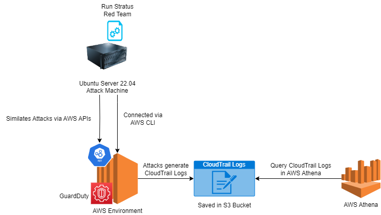

# SIGMA for incident response AWS 
Copyright (c) 2023 Invictus Incident Response <br>
Author [BertJanCyber](https://twitter.com/BertJanCyber)

# Introduction
This repository provides the information and the queries needed to execute the Sigma rules in AWS Athena. This is done to investigate the first response capabilities that Sigma has. This repository contians a dataset on which all AWS Attack Techniques from the [Stratus Red Team](https://stratus-red-team.cloud/) tool have been simulated. Furthermore, the repository contains all (un)supported Sigma rules for AWS. Lastly all the translated Sigma to AWS Athana queries are shared and can be used to identify malicious activities.

The dataset can be used to build new detections or to train personal into identifying malicious activities in your environment.

# Usage
If you have an AWS environment yourself and you want to check if you can identify malicious activities in this environment, then you can run the queries from the [Sigma Athena SQL](./Sigma%20Athena%20SQL/) directory in the AWS Athena portal.

To use the [CloudTrail dataset](./CloudTrail/) download the *CloudTrail* folder. Next create and S3 bucket and place the files in this repository. Then peform the actions as documented by AWS: [Configure Environment](https://docs.aws.amazon.com/athena/latest/ug/cloudtrail-logs.html).

## Splunk
If you want to use Splunk to query the dataset, the following steps need to be taken.

1. Download the CloudTrail directory
2. Create a new sourcetype in the props.conf for the CloudTrail logs with the following content:
```
[cloudtrail_offline]
SHOULD_LINEMERGE = false
TRUNCATE = 8388608
TIME_PREFIX = \"eventTime\"\s*\:\s*\"
LINE_BREAKER = ((\{"Records":\[)*|,*){"eventVersion"
TIME_FORMAT = %Y-%m-%dT%H:%M:%S%Z
MAX_TIMESTAMP_LOOKAHEAD = 28
KV_MODE = json

```
3. Create a new input for the CloudTrail logs pointing to the directory with the CloudTrail logs and the newly created sourcetype for example:
```
[monitor://C:\Users\invictus\aws-research\CloudTrail\*.json]
disabled = false
host = aws
index = <name_of_index>
sourcetype = cloudtrail_offline
```
4. Restart Splunk and your CloudTrail data should be beautifully parsed and ready to be searched with the provided SPL queries.

# CloudTrail logs
The dataset containing the CloudTrail logs has been generated using the environment below. An external machine has been used, which leveraged the Stratus Red Team tool to simulate attacks. Via the AWS CLI, the required infrastructure was deployed in the configured AWS environment. 

The attack simulations resulted in entries in the CloudTrail logs, such as deploying of EC2 instances, but also the deletion of CloudTrails to evade detection. Stratus currently implemented 27 different attack techniques, which are categorised in 8 out of the 11 [MITRE ATT&CK Cloud Matrix](https://attack.mitre.org/matrices/enterprise/cloud/) tactics.

The last part of the environment is AWS Athana, which was used as SIEM to query the CloudTrail logs. This can be done both from the user interface, but also from the commandline.



## Translating new AWS Sigma queries to AWS Athena
If new queries are added to Sigma, it is possible to translate them. This can partially be done by [uncoder.io](https://uncoder.io/). Copy the Sigma rule on the left side and select Sigma, set the right side to AWS Athena Query. This results in a pre-processed SQL query, which then needs to be further translated with the [Translation script](./translator/FixSigmaToAthena.py).
